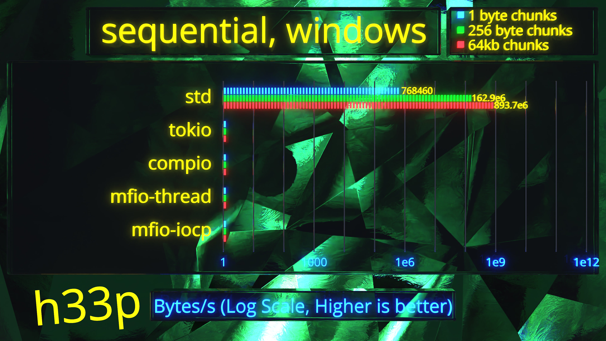
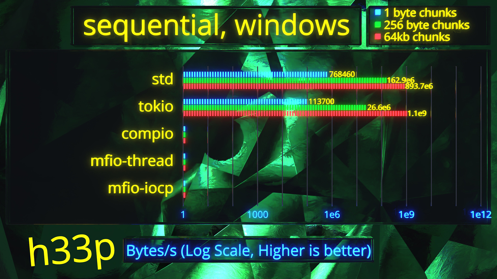
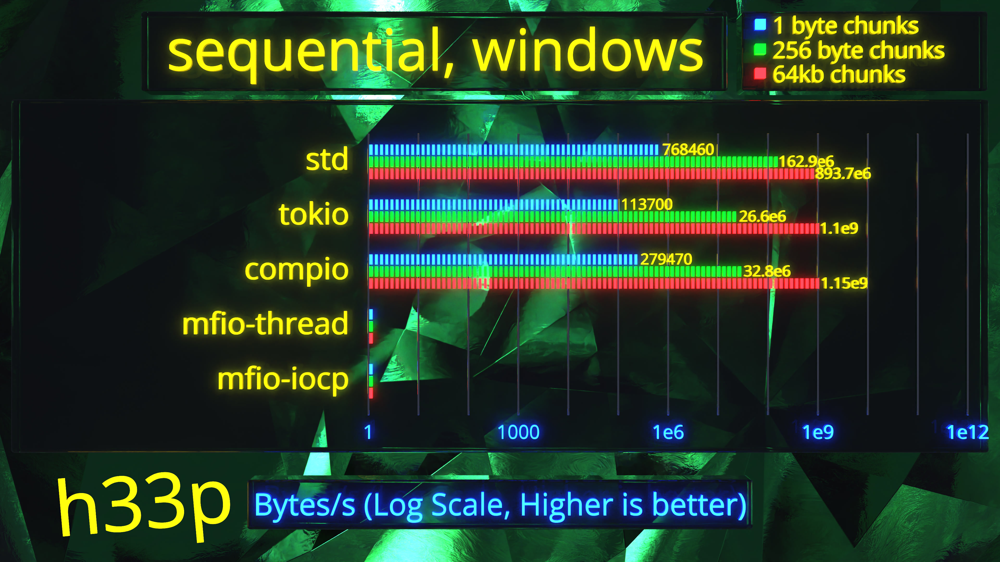
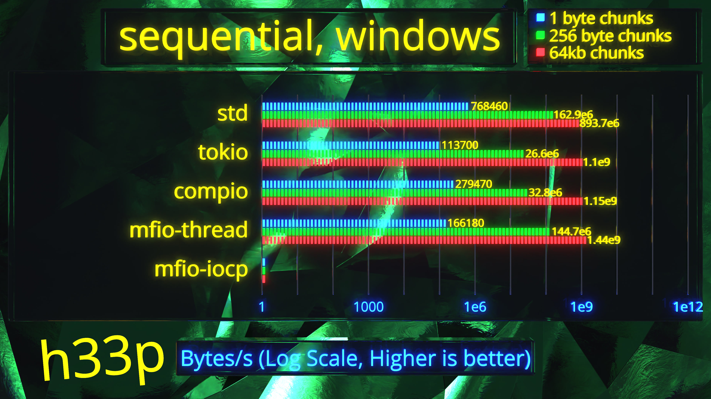
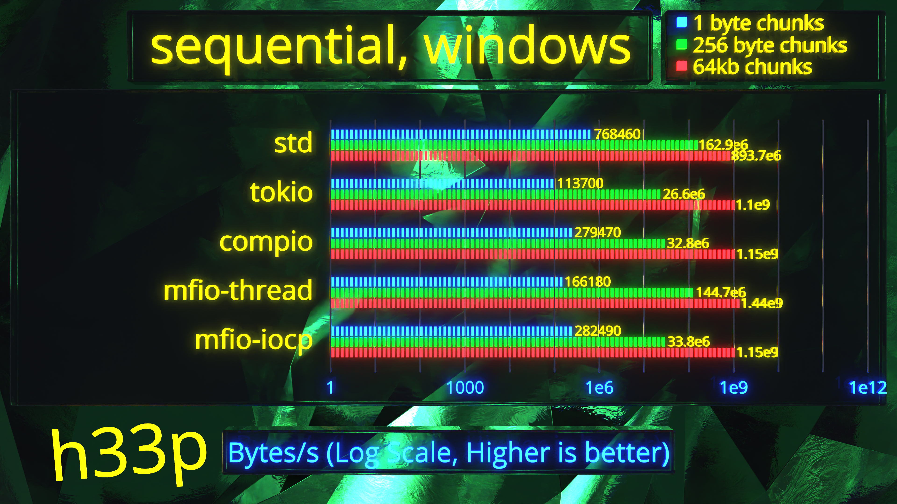
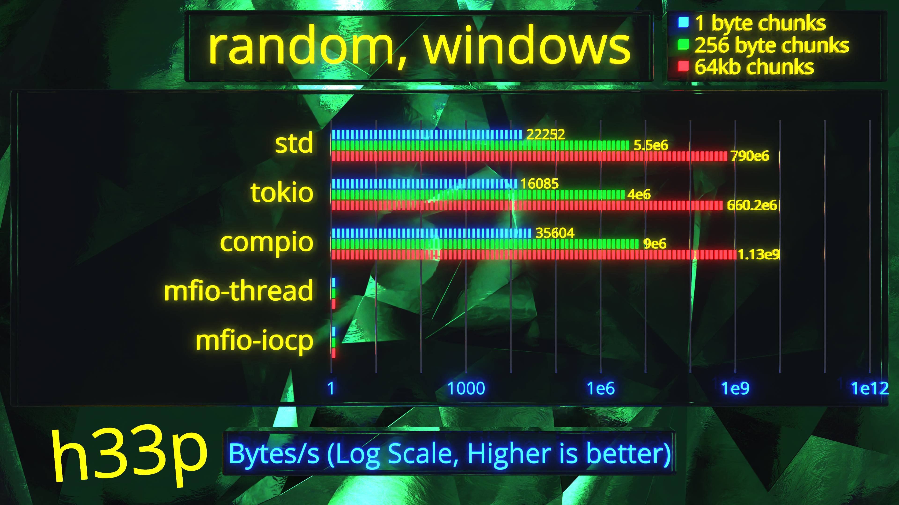
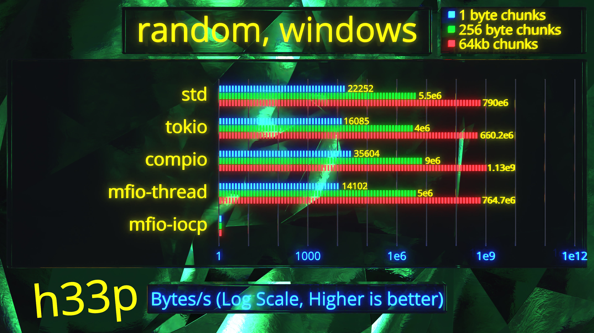

<!-- class: invert -->

# mfio
## Flexible completion I/O

By Auri/h33p
github.com/memflow/mfio

<!--
This is a one-stop shop for building custom I/O. A framework, defined by two traits. You can use it as an asynchronous runtime, seamlessly integrating with tokio, if you wish, or, build something bespoke, with zero dependence on the standard library.
-->

---

# In this video

* Motivation
* Benchmarks
* Usage

<!--
In this video I'll iterate through why we came up with `mfio`, how it compares to conventional I/O systems, and how you can use it to build things trivially, that before were extremely arduous to create.
-->

---

# Files, historically

<!--
I/O can be anything, but for practical purposes, let's consider files. 
-->

---

# RW head (pointer) - posix lseek

<!--
Historically OS considers files as tapes with a read and write head. Whenever you want to extract data, you first need to move the head to appropriate location, and then, issue a read. This is great, if you wish to process the file sequentially, but
-->

---

# RW head - global across threads (needs mutexes)

<!--
in any concurrent and random access scenario, this system's performance disintegrates. In addition,
-->

---

# SSDs

## Number of physical heads - 0 
## Distance to latency factor - 0

<!--
ever since solid state drives, this model can be considered archaic, antiquated, obsolete.
-->

---

# pread/pwrite

```c
#include <unistd.h>

ssize_t pread(int fd, void buf[.count], size_t count,
              off_t offset);
ssize_t pwrite(int fd, const void buf[.count], size_t count,
              off_t offset);
```

<!--
A better model involves inclusion of the position with each I/O request, but that doesn't solve the concurrency problem.
-->

---

# preadv is not the answer

```c
ssize_t preadv(int fd, const struct iovec *iov, int iovcnt,
               off_t offset); // one offset per batch
```

# "better" API (does not exist)

```c
ssize_t preadvx(int fd, const struct iovec *iov, int iovcnt,
               off_t *offsets); // one offset per iovec
```

<!--
A manageable way to deal with concurrency is introducing batching. You queue up as many I/O operations as you can, and submit them in one go. This is great for very fast I/O, because we optimize system call performance. However, this is cumbersome to work with from the user's perspective, and does not address very long requests.
-->

---

# Windows overlapped I/O

```c
BOOL ReadFileEx(
  HANDLE                          hFile,
  LPVOID                          lpBuffer,
  DWORD                           nNumberOfBytesToRead,
  LPOVERLAPPED                    lpOverlapped, // fill this in
  LPOVERLAPPED_COMPLETION_ROUTINE lpCompletionRoutine // don't, bad
);
```

<!--
The perfect model is the one that is asynchronous. It is much harder to design one, but once you do, you win the following things:
-->

---

# Async wins

* Automatic batching
* Computation during I/O

<!--
1. Automatically batch operations without user having to think about batches. Instead, the user needs to think about dependencies.
2. User can compute while the system is constantly being fed with data.
-->

---

# mfio wins

* Partial results
* I/O to/from stack
* Sync API for free
* `no_std`

<!--
`mfio` achieves the these, and additional more:

1. Every request may get partially and non-sequentially completed. This is incredibly useful for sparse resources.
2. We maintain support for doing I/O between the stack and the destination. This ensures `mfio` can be as close to zero-cost abstraction as possible.
3. If you don't care about async, the system was specifically built to have an elegant, cost-effective way to resolve async code without subjecting the user to it.
4. Finally, the system does not build on the assumptions of the standard library, or any underlying operating system. This means, the core library can be used as a framework for providing I/O on any custom operating system, or embedded environment.

I did all of this, because I was not satisfied with memflow's synchronous API. In fact,
-->

---


<!--
we had similar ideas floating around, back in 2020. This project was originally meant just for memflow, and it will be used in memflow, resulting in probably the greatest upgrade to the library, this decade.
-->

---

<!--
However, `mfio` has far wider reach in other non-experimental parts of the Rust ecosystem. Like, I usually tend to be humble, but I'm extremely proud of this.
-->

---

# Benchmarks

---

<!-- transition: fade -->


<!--
Let's do a comparison with other systems. We are doing a simple set of tests - sequential and random performance. We will perform very small reads on a 8GB file, of 1 byte, medium ones of 256 bytes and large ones of 64 kilobytes. We could be more granular, but this covers most of the bases. And if you want to see the full report, then overflow the like button and grab the link from the description down `below.
-->

---


<!--
Starting with the control, standard library performance ranges from 3.2 megabytes all the way up to 3.69 gigabytes. Note that this test favors standard library a lot, because operating systems love files to be accessed sequentially and thus are able to perform read-aheads.
-->

---


<!--
Now, as for tokio, a really surprising thing is that performance, is quite terrible. Here on the lower end we have 56 kilobytes, while 64k chunks are at a relatively reasonable 1.7 gigabytes. One of the reasons for this is that tokio invokes standard library functions on a blocking thread pool, therefore there's a lot of synchronization overhead happening.
-->

---


<!--
Now, the final control datapoint is glommio, a really wonderful io_uring async runtime. As you can see, it is slower than the standard library, and this is because once again, operating systems are optimized for sequential access.

So, now we have 2 mfio backends. There's a third one based on mio, but it would end up somewhere in-between these 2. 
-->

---


<!--
The thread backend is always available, and it's extremely simple, it spawns unique threads for both read and write operations of a given file. It's very unoptimized, yet it behaves about as well as glommio. Even better on the 1 byte side. Meanwhile,
-->

---


<!--
our io_uring backend right here, is mind you, severely underoptimized. Actually, all these mfio backends were built to test the core library, to see whether its design makes sense, and there's so much more to be done under the hood to make them even faster. So io_uring, as you can see, blows everything apart from std, out of the water, and at the top end, we actually win, even though, i'd caution there's some run to run variance. This is wonderful, but mind you, we did not do all this for sequential performance -
-->

---


<!--
random performance is where we truly shine.
-->

---


<!--
Going back to the standard library, the results are way more modest.  1 byte reads, are absolutely unusable, while 64k is, okay.
-->

---


<!--
Tokio suffers even more, being around 30% slower than std,
-->

---


<!--
glommio really shows the power of completion I/O. For reference, what we are doing under the hood on glommio and mfio, is feed 64 megabytes of I/O operations into the backend, and process the results as they come, generating more requests, until a set number of requests complete. This makes glommio around 5 times faster than std up until 64k chunks, where it is just a modest 2.7 times faster than the standard library. For reference, the highest sequential throughput was 3.8 gigabytes, so we are not too far off.
-->

---


<!--
Now, for mfio. The thread backend is not impressive - as expected, it behaves like the std backend, but slower due to thread synchronization.
-->

---


<!--
io_uring is where the magic happens, and as you can see, we're quite close to glommio. It's a bit faster, but they're quite similar, which makes sense, because both are based on the same kernel interface. What this shows is that we have more ways to go, but we are already so much better than the rest. However, what glommio does not have is windows support.
-->

---


<!--
Once again, we are back to sequential tests. Instead of glommio, we're testing against compio, which by the way has a linux backend, but here it's using iocp, and instead of io_uring, we have iocp backend for mfio.
-->

---



<!--
The numbers are different, of course, even though we are using identically specced VM. I suppose there's some overhead for not using virtio disks, but that's besides the point.
-->

---



<!--
Tokio once again is very slow, apart from 64k chunks, which was surprising to see actually.
-->

---



<!--
Compio behaves pretty much like tokio.
-->

---



<!--
Thread becomes much faster, which makes me suspect that there's a lot of funny caching behavior happening on windows kernel. Mind you, we intentionally ran this test on a 2GB ram machine against an 8GB random file, so OS has to pick and choose what it caches, but evidently, here it made better choices.
-->

---



<!--
mfio-iocp looks fairly identical to compio. The results basically show that iocp is not helping all that much. And if you look at the differences between iocp and io_uring, it makes sense, because iocp still needs 1 system call per operation.
-->

---


<!--
Okay, let's check random.
-->

---


<!--
Standard library, much slower,
-->

---


<!--
tokio around the same. This behavior is way different from linux.
-->

---



<!--
As you can see, compio takes the lead, almost twice as fast at 256 byte reads.
-->

---



<!--
Thread is basically the same as tokio, but slightly better, and
-->

---

<!-- transition: none -->


<!--
our iocp backend is neck to neck with compio. Overall, this is a good example that shows you that completion I/O, like mfio, has potential for much better performance, but if the operating environment does not expose the right building blocks, not much can be done to remedy the situation.
-->

---

# Example

<!--
Finally, here's a simple usage sample. Suppose you want to read a file. First,
-->

---

```rust
use mfio::error::Result;
use mfio_rt::*;

fn main() -> Result<()> {
    let rt = NativeRt::default();
}
```

<!--
create an instance of a runtime, then
-->

---

```rust
use mfio::backend::*;
use mfio::error::Result;
use mfio_rt::*;

fn main() -> Result<()> {
    let rt = NativeRt::default();

    rt.block_on(async {
        Ok(())
    })
}
```

<!--
spin it up. Inside the async block,
-->

---

```rust
use mfio::backend::*;
use mfio::error::Result;
use mfio_rt::*;

fn main() -> Result<()> {
    let rt = NativeRt::default();

    rt.block_on(async {
        let file = rt
            .open(Path::new("Cargo.toml"), OpenOptions::new().read(true))
            .await?;

        Ok(())
    })
}
```

<!--
invoke open function, supply a file name, and await. Now,
-->

---

```rust
use mfio::backend::*;
use mfio::error::Result;
use mfio::traits::*;
use mfio_rt::*;

fn main() -> Result<()> {
    let rt = NativeRt::default();

    rt.block_on(async {
        let file = rt
            .open(Path::new("Cargo.toml"), OpenOptions::new().read(true))
            .await?;

        let mut buf = vec![];
        file.read_to_end(0, &mut buf).await?;

        Ok(())
    })
}
```

<!--
create a buffer, and read everything to it.
-->

---

```rust
use mfio::backend::*;
use mfio::error::Result;
use mfio::traits::*;
use mfio_rt::*;

fn main() -> Result<()> {
    let rt = NativeRt::default();

    rt.block_on(async {
        let file = rt
            .open(Path::new("Cargo.toml"), OpenOptions::new().read(true))
            .await?;

        let mut buf = vec![];
        file.read_to_end(0, &mut buf).await?;

        let data = String::from_utf8_lossy(&buf);
        println!("{data}");

        Ok(())
    })
}
```

<!--
Print out the result, and that's basically it. Now, let's say we want to do this over the network.
-->

---

```rust
use mfio::backend::*;
use mfio::error::Result;
use mfio::traits::*;
use mfio_rt::*;
use mfio_netfs::*;

fn main() -> Result<()> {
    let rt = NativeRt::default();
    let rt = NetworkFs::with_fs("127.0.0.1:4446".parse().unwrap(), rt.into(), true)?;

    rt.block_on(async {
        let file = rt
            .open(Path::new("Cargo.toml"), OpenOptions::new().read(true))
            .await?;

        let mut buf = vec![];
        file.read_to_end(0, &mut buf).await?;

        let data = String::from_utf8_lossy(&buf);
        println!("{data}");

        Ok(())
    })
}
```

<!--
Simply add a second in-between step to build a network filesystem, an experimental version of it is provided, supply an IP address, grab it by running a server node, and then compile and run it. That's it, you've got remote filesystem with a single line of code. Your application does not have to care, what's the underlying I/O backend.
-->

---

# mfio

* Flexible, high-performance
* No battle testing
* Incomplete
* Cool asf

<!--
As you can see, `mfio` is an elastic, malleable system achieving production-grade performance. Now, we are far from stable, there's no battle testing done yet, so be careful, however, we a comprehensive test suite, and everything passes, so most things should work, but I can't say this is a proven choice for your next mars rover. Next year, maybe? In addition, the runtime crate is still incomplete, but it can do files and serve over TCP, and if you're interested in getting into the weeds, and give any feedback that you may have. The base is done, there's more shaping to be done, and in the long term, this should be a remarkable framework.
-->

---

# Get started today!

## github.com/memflow/mfio

<!--
So thanks for watching, and if you enjoyed this, be sure to overflow the like button, and see you around. My name was h33p, your's was undefined, see ya.
-->

