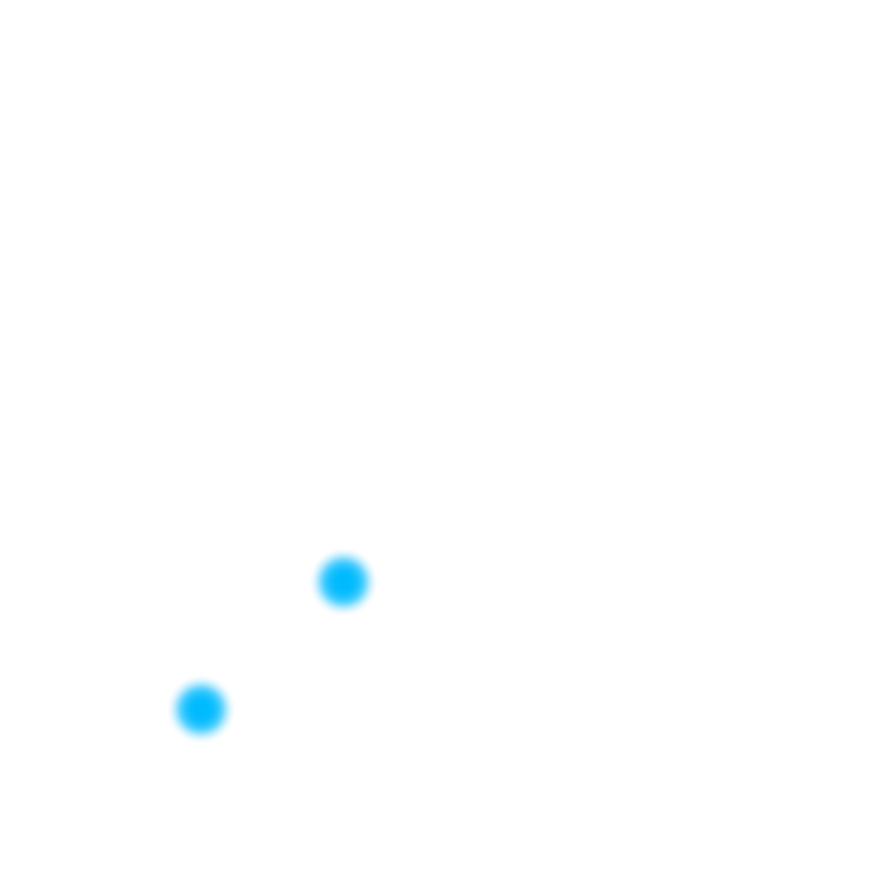
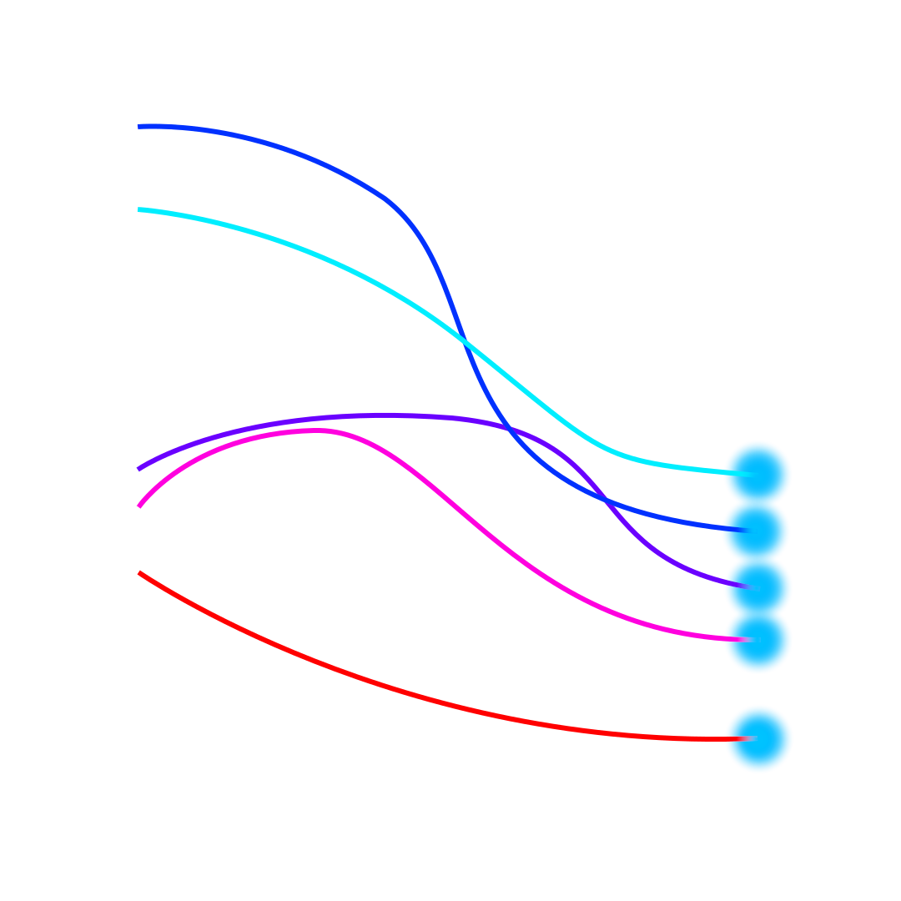

<!-- class: invert -->

# Rust
## Greita, saugi ir produktyvi programavimo kalba

Aurimas Blažulionis
github.com/h33p/slides

<!--
Checklist:

- Ask people to slow me down when needed
-->

---

# Apie mane

* Studijuoju Oksforde kibernetinę saugą
* Dirbu Chorus One prie hostinimo
* Pirma Rust patirtis 2019 metais
* Dabar beveik kasdien naudoju

---

# Šioje paskaitoje

* Kitos kalbos
* Rust pradmenys
* Rust ypatybės
* Kiti įdomūs faktai

<!--
Šioje paskaitoje bus daug palyginimo su C++, ką tikiuosi pažįstate, tačiau C++ yra labai plati
kalba, kuri turi daug keistenybių - jeigu kažkas neaišku, klauskite.
-->

---

# 1. Kitos kalbos

---

# Kalbų skirtumai

* Sintaksė
* Abstrakcijų lygis
* Veikimo principas
* Ekosistema
* Bendruomenė

<!--
Paklausk, kiek skirtingų kalbų žmonės yra matę/naudoję.
-->

---

# Kompromisai

* Greitis
* Produktyvumas
* Korektiškumas/saugumas
* Lankstumas
* Perkialiamumas

<!--
TODO: paaiškinti sąvokas
-->

---

# Produktyvumas ir korektiškumas


---

# Produktyvumas ir korektiškumas


---

# Produktyvumas ir korektiškumas



---

# Produktyvumas ir korektiškumas


---

# Produktyvumas ir korektiškumas


---

# Produktyvumas ir korektiškumas


---

# Produktyvumas ir korektiškumas


---

# Produktyvumas ir korektiškumas


---

# Produktyvumas ir korektiškumas


---

# Produktyvumas ir korektiškumas


---

# Produktyvumas, greitis ir korektiškumas

 

---

# Produktyvumas, greitis ir korektiškumas

 

---

# Produktyvumas per laiką


---

# Produktyvumas per laiką


---

# Produktyvumas per laiką


---

# Produktyvumas per laiką


---

# Produktyvumas per laiką


---

# Produktyvumas per laiką



---

# Produktyvumas per laiką


---

# Produktyvumas per laiką


---

# Produktyvumas per laiką


---

## Rust aukoja pradinį produktyvumą,
# kad produktyvumas išliktų dideliuose projektuose

---

# 2. Rust pradmenys

---

# Labas, pasauli

```rust
fn main() {
    println!("Hello, world!");
}
```

---

# Labas, pasauli (kitomis kalbomis)

```c
#include <stdio.h>

int main() {
    printf("Hello, world!\n");
    return 0;
}
```

```cpp
#include <iostream>

int main() {
    std::cout << "Hello, world!" << std::endl;
    return 0;
}
```

```py
print("Hello, world!")
```

---

# Labas, pasauli (Rust ir C++)

```cpp
#include <iostream>

int main() {
    std::cout << "Hello, world!" << std::endl;
    return 0;
}
```

```cpp
#include <iostream>

auto main() -> int {
    std::cout << "Hello, world!" << std::endl;
    return 0;
}
```

```rust
fn main() -> () {
    println!("Hello, world!");
}
```

---

# Pagrindiniai tipai

* `void` -> `()`
* `int` -> `i32`
* `unsigned int` -> `u32`
* `long` -> `i32`/`i64`
* `unsigned long` -> `u32`/`u64`
* `size_t` -> `usize`
* `char *` -> `&str`
* `std::string` -> `String`
* `T[]` -> `[T]`
* `std::vector<T>` -> `Vec<T>`

---

# Kintamieji

```rust
fn main() {
    let a = 5;
    let b: u8 = 42;
    println!("{a} + {b} = {}", a + b);
}
```

---

# Funkcijos

```rust
fn sum(a: usize, b: usize) -> usize {
    a + b
}

fn main() {
    let a = 5;
    let b = 42;
    let sum = sum(a, b);
    println!("{a} + {b} = {sum}");
}
```
---

# Mutability (kintamumas)

```rust
fn main() {
    let mut a = 5;
    a += 20;
}
```

---

# Įvestis

```rust
use std::io;

fn main() {
    println!("Įveskite skaičių:");

    let mut line = String::new();

    io::stdin()
        .read_line(&mut line)
        .unwrap();

    let num = line
        .trim()
        .parse::<usize>()
        .unwrap();

    println!("Jūs įvedėte: {num}");
}
```

---

# Sąlygos

```rust
fn salyga(num: usize) {
    if num > 10 {
        println!("Daugiau nei 10")
    } else if num <= 50 {
        println!("Ne daugiau nei 50")
    } else {
        println!("Daugiau nei 50 arba mažiau nei 10")
    }
}
```

---

# Ciklai

```rust
fn ciklas(mut num: usize) {
    while num > 0 {
        println!("{num}");
        num -= 1;
    }
}
```

```rust
fn ciklas(mut num: usize) {
    for i in (0..=num).rev() {
        println!("{i}");
    }
}
```

```rust
fn ciklas(mut num: usize) {
    for i in 0..num {
        println!("{i}");
    }
}
```

---

# Užduotys

## blaz.is/hidden/nma-2024-sesija

### Iki Strings

---

# 3. Rust ypatybės

<!--
Paklausk, ar dabar užduotis darom, ar vėliau
-->

---

# `Option<T>`

```rust
fn get_number_square(value: &str, nums: &[usize]) -> Option<usize> {
    let idx = value.parse::<usize>().ok()?;
    let num = nums.get(idx)?;
    Some(num * num)
}

fn main() {
    let nums = [2, 3, 5, 3, 4];

    if let Some(num) = get_number_square("3", &nums) {
        println!("Square: {num}");
    }
}
```

---

# `Result<T, E>`

```rust
use std::error::Error;
use std::io;

/// Rezultato tipas visam projektui
type Result<T> = std::result::Result<T, Box<dyn Error>>;

fn read_num() -> Result<usize> {
    let mut line = String::new();

    io::stdin()
        .read_line(&mut line)?;

    let num = line
        .trim()
        .parse::<usize>()?;

    Ok(num)
}

fn main() {
    println!("Įveskite skaičių:");

    match read_num() {
        Ok(num) => println!("Jūs įvedėte: {num}"),
        Err(e) => println!("Nepavyko nuskaityti skaičiaus: {e}"),
    }
}
```

---

# Struktūros

```rust
pub struct Animal {
    name: String,
    age: usize,
}

impl Animal {
    pub fn new(n: String, age: usize) -> Self {
        Self {
            name: n,
            age,
        }
    }
}
```

---

# Enumeracijos ir `match`

```rust
enum Animal {
    Cat,
    Dog(Dog),
    Rat {
        name: String,
        age: usize,
    }
}

impl Animal {
    fn age(&self) -> usize {
        match self {
            Self::Cat => panic!("Cats have too many lives to have an age"),
            Self::Dog(dog) => dog.age,
            Self::Rat {
                age,
                ..
            } => *age,
        }
    }
}
```

<!--
Parodyk playgrounde daugiau pattern matchinimo
-->

---

# Traits

```rust
pub struct Dog {
    name: String,
    age: usize,
}

pub trait Animal {
    fn name(&self) -> &str;
    fn age(&self) -> usize;
}

impl Animal for Dog {
    fn name(&self) -> &str {
        &self.name
    }

    fn age(&self) -> usize {
        self.age
    }
}

```

---

# Traits

```rust
pub struct Dog {
    name: String,
    age: usize,
}

impl ToString for Dog {
    fn to_string(&self) -> String {
        format!("{} at age {}", self.name, self.age)
    }
}
```

---

# Traits

```rust
pub trait Animal {
    fn name(&self) -> &str;
    fn age(&self) -> usize;
}

pub trait Bipedal: Animal {
    fn height(&self) -> f32;
}
```

---

# Ekosistema

---

# Ownership

```rust
fn example(a: &mut usize, b: &mut usize, c: usize) {
    *a += c;
    *b *= c;
    *a += c;
}

fn main() {
    let mut a = 5;

    example(&mut a, &mut a, 10);
}
```

---

# Ownership

```
   Compiling playground v0.0.1 (/playground)
error[E0499]: cannot borrow `a` as mutable more than once at a time
 --> src/main.rs:10:21
  |
9 |     example(&mut a, &mut a, 10);
  |     ------- ------  ^^^^^^ second mutable borrow occurs here
  |     |       |
  |     |       first mutable borrow occurs here
  |     first borrow later used by call

For more information about this error, try `rustc --explain E0499`.
error: could not compile `playground` (bin "playground") due to previous error
```

---

## Race conditions

```cpp
#include <iostream>
#include <thread>

int sharedVariable = 0;

void increment() {
    for (int i = 0; i < 10000; ++i) {
        ++sharedVariable;
    }
}

int main() {
    std::thread thread1(increment);
    std::thread thread2(increment);

    thread1.join();
    thread2.join();

    std::cout << "Expected: 20000, Actual: " << sharedVariable << std::endl;

    return 0;
}
```

---

## Aliasing

```cpp
#include <iostream>

void example(int& __restrict__ a, int& __restrict__ b, int c) {
	a += c;
	b *= c;
	a += c;
}

int main() {
    int a = 5;

    example(a, a, 100);

    std::cout << a << std::endl;
}
```

---

# Async

---

# Async

```rust
use tokio::time::{sleep, Duration};

async fn f1() {
    for i in 0..10 {
        println!("> f1: {i}");
        sleep(Duration::from_millis(200)).await;
    }
}

#[tokio::main]
async fn main() {
    f1().await;
}
```

---

# Async

```rust
use tokio::time::{sleep, Duration};

async fn f1() {
    for i in 0..10 {
        println!("> f1: {i}");
        sleep(Duration::from_millis(200)).await;
    }
}

async fn f2() {
    for i in 0..5 {
        println!(">> f2: {i}");
        sleep(Duration::from_millis(400)).await;
    }
}

#[tokio::main]
async fn main() {
    f1().await;
    f2().await;
}
```

---

# Async

```rust
use tokio::time::{sleep, Duration};

async fn f1() {
    for i in 0..10 {
        println!("> f1: {i}");
        sleep(Duration::from_millis(200)).await;
    }
}

async fn f2() {
    for i in 0..5 {
        println!(">> f2: {i}");
        sleep(Duration::from_millis(400)).await;
    }
}

#[tokio::main]
async fn main() {
    tokio::join! {
        f1(),
        f2(),
    };
}
```

---
